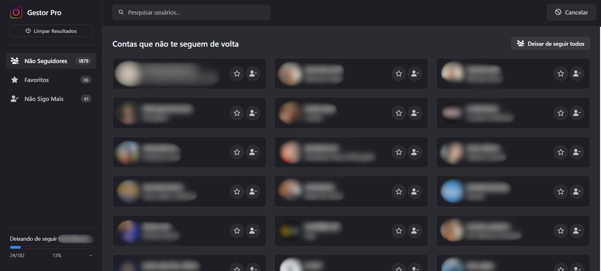

# Gestor Pro para Instagram


Uma extensão para Chrome de código aberto projetada para gerenciar de forma inteligente e segura sua lista de contas que você segue no Instagram. A ferramenta identifica perfis que não te seguem de volta e oferece funcionalidades para gerenciá-los.

---

### Screenshot

*Print da tela da extensão em funcionamento*


---

### ✨ Principais Funcionalidades

* **Análise de Não-Seguidores**: Compara sua lista de "seguindo" e "seguidores" para identificar quem não te segue de volta.
* **Unfollow Seguro**: Deixe de seguir contas individualmente ou em lotes.
* **Limite de Segurança**: O modo de "unfollow em massa" é limitado a 200 contas por vez para proteger sua conta contra bloqueios.
* **Pausas Inteligentes**: Inclui pausas longas (com contagem regressiva visual) entre as ações de unfollow para simular comportamento humano.
* **Sistema de Favoritos**: Marque contas como "favoritas" para protegê-las e evitar que sejam removidas acidentalmente.
* **Cancelamento de Tarefas**: Cancele operações longas (análise ou unfollow) a qualquer momento.
* **Interface Integrada**: A barra de progresso aparece de forma discreta no rodapé, sem bloquear a tela.
* **Persistência de Dados**: Suas listas são salvas localmente. Você pode fechar e reabrir a extensão sem perder o progresso.
* **Limpeza Fácil**: Um botão "Limpar Resultados" permite resetar todos os dados para analisar um novo perfil do zero.

---

### 🚀 Como Instalar

Como esta é uma extensão não publicada na Chrome Web Store, ela precisa ser instalada manualmente:

1.  Faça o download ou clone este repositório: `git clone https://github.com/MadsonJhones/Nao_Seguidores.git`
2.  Abra o Google Chrome e vá para a página de extensões: `chrome://extensions`
3.  No canto superior direito, ative o **"Modo de desenvolvedor"**.
4.  Clique no botão **"Carregar sem compactação"** (Load unpacked).
5.  Selecione a pasta do projeto que você baixou.
6.  A extensão "Gestor Pro" aparecerá na sua lista e estará pronta para uso.

---

### 📖 Como Usar

1.  Navegue até o seu perfil no site do Instagram (`https://www.instagram.com//seu_usuario`).
2.  Clique no ícone do "Gestor Pro" na barra de ferramentas do Chrome. A interface da extensão será aberta em uma nova aba.
3.  **Para analisar um perfil pela primeira vez ou começar do zero:** clique em **"Limpar Resultados"**. Isso irá apagar todos os dados antigos.
4.  **Para analisar ou atualizar o perfil atual:** clique em **"Analisar Perfil"**.
5.  Aguarde a análise terminar. A barra de progresso no canto inferior esquerdo mostrará o andamento.
6.  Gerencie as listas nas abas "Não Seguidores" e "Favoritos" usando os botões de ação.

---

### ⚠️ Manutenção e Longevidade da Extensão

**IMPORTANTE:** Esta extensão depende da API interna e oficial do Instagram. O Instagram muda essa API periodicamente para combater bots e ferramentas não autorizadas. Isso significa que, de tempos em tempos, **a extensão vai parar de funcionar.**

#### **Como saber que quebrou?**
O principal sintoma será o que já vivenciamos: ao clicar em "Analisar Perfil", o processo terminará rapidamente e o resultado será **"0 seguindo"** e **"0 seguidores"**, mesmo que sua conta tenha milhares.

#### **Como consertar?**
O problema quase sempre está nos **cabeçalhos (`headers`)** da requisição, que servem como uma "chave de acesso" para a API. Para consertar, você precisará atualizar esses valores no arquivo `background.js`.

1.  **Abra o arquivo `background.js`** no seu editor de código.
2.  **Encontre o objeto `headers`**, por volta da linha 105. Ele se parece com isto:
    ```javascript
    const headers = {
        'x-ig-app-id': '1217981644879628',
        'x-csrftoken': csrfCookie.value,
        'x-ig-www-claim': '0',
        'X-Requested-With': 'XMLHttpRequest'
    };
    ```
3.  O valor que mais comumente precisa ser atualizado é o `'x-ig-app-id'`.

#### **Como encontrar um novo `'x-ig-app-id'` válido?**
Você precisa "espionar" o próprio site do Instagram:
1.  Abra o site `instagram.com` em uma aba normal.
2.  Abra as **Ferramentas de Desenvolvedor** (clique com o botão direito na página > Inspecionar, ou pressione F12).
3.  Vá para a aba **"Rede" (Network)**.
4.  Filtre as requisições por **"Fetch/XHR"**.
5.  Navegue pelo site (clique em um perfil, veja um story, etc.) até ver novas requisições aparecendo na lista.
6.  Clique em uma dessas requisições (geralmente para `api/v1/...`).
7.  Na nova janela que se abre, na aba "Cabeçalhos" (Headers), role para baixo até "Cabeçalhos da solicitação" (Request Headers) e procure por `x-ig-app-id`.
8.  Copie o valor que encontrar lá e cole no seu código em `background.js`.
9.  Salve o arquivo, recarregue a extensão em `chrome://extensions` e teste novamente.

---

### Disclaimer de Uso Responsável

Esta ferramenta foi desenvolvida para fins educacionais e de gerenciamento pessoal. A automação de ações no Instagram pode violar os termos de serviço da plataforma. Use esta extensão com moderação e por sua conta e risco. O desenvolvedor não se responsabiliza por quaisquer restrições ou bloqueios que possam ocorrer em sua conta.

---

### Licença

Este projeto é distribuído sob a licença MIT.